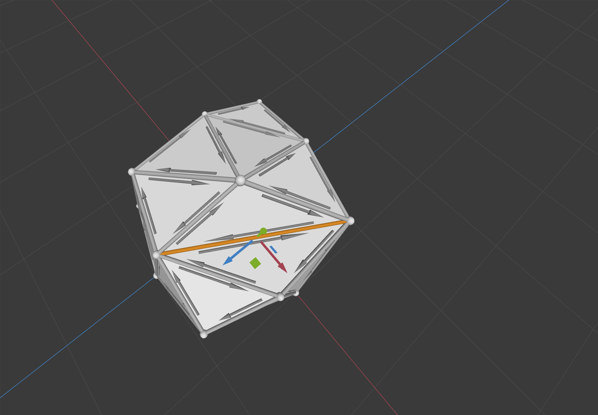
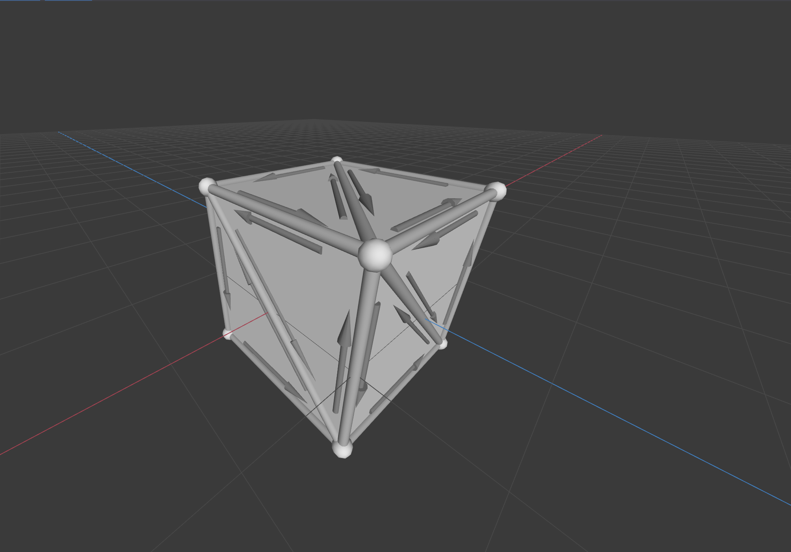
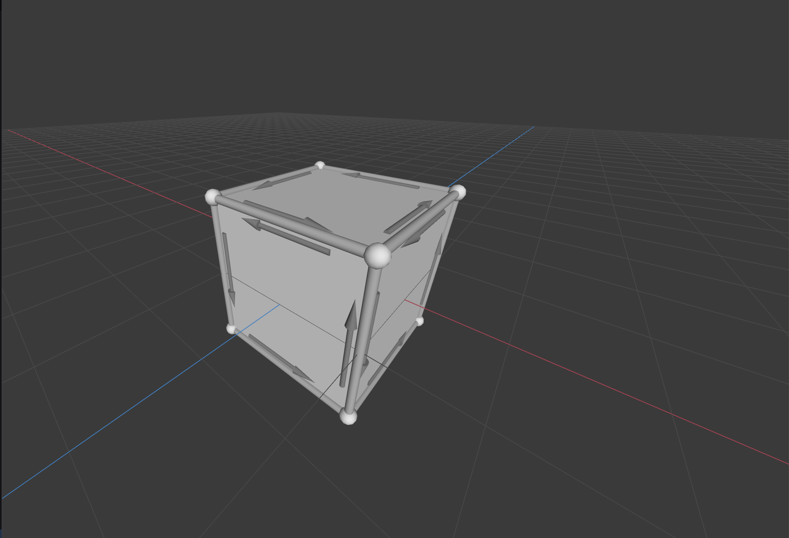
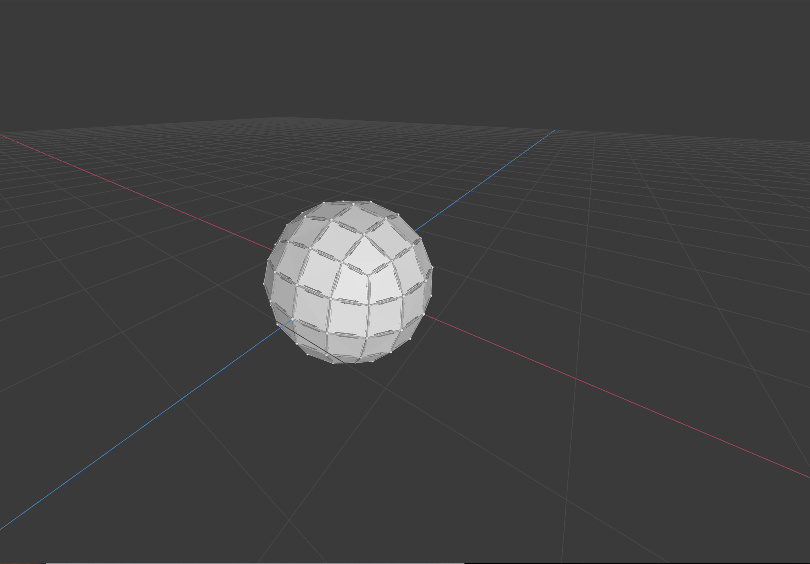
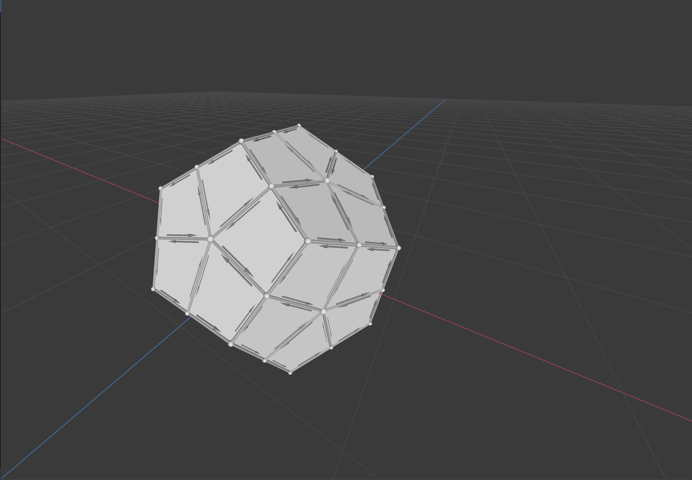
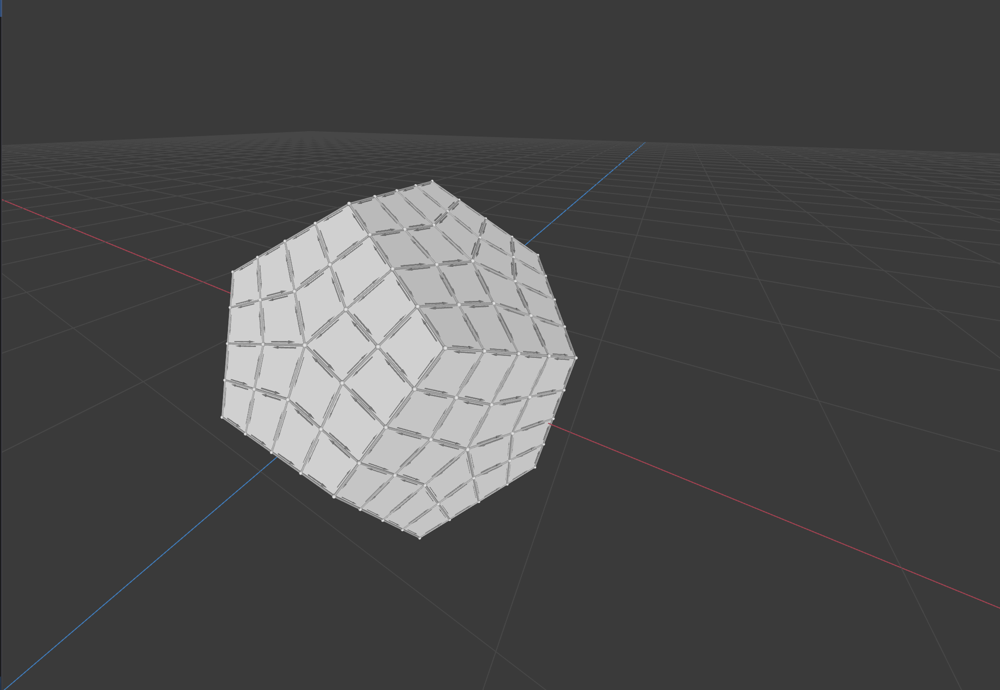
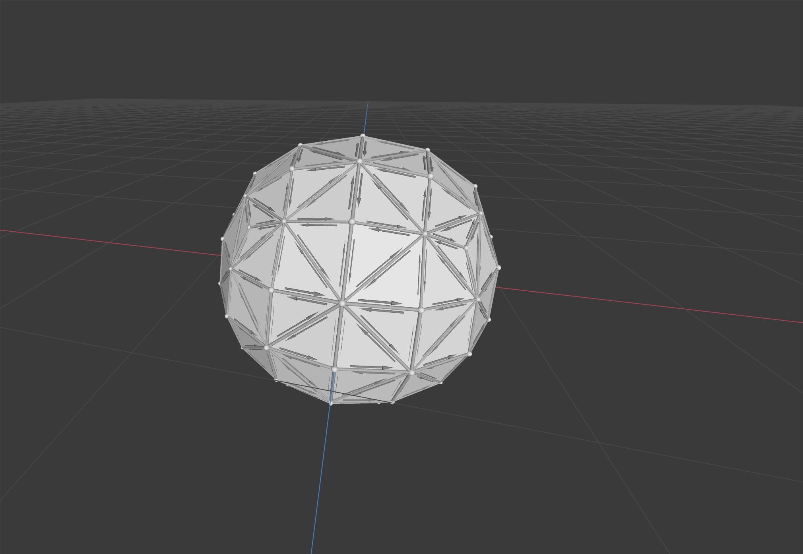
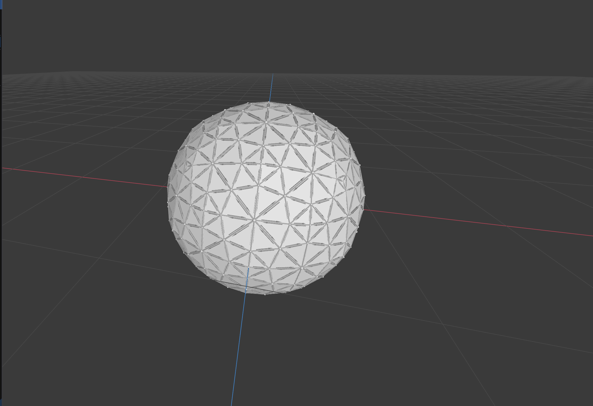

## Welcome to GitHub Pages

You can use the [editor on GitHub](https://github.com/SiqiHuang18/SH_Meshedit/edit/gh-pages/index.md) to maintain and preview the content for your website in Markdown files.

# SH_Meshedit
This project implements various mesh processing algorithm using Half Edge Mesh data structure. This data structure allows easy traversal and modification of edge.

## Local Operations
### Edge Flip
 
### Edge Split
 
### Edge Collapse
 
### Erase Vertex
 
## Global Operations
### Triangulate
 
### Catmull-Clark Subdivision
  
### Linear Subdivision
  
### Loop Subdivision
  
### Simplification Using Quadratic Error
### Isotropic Remeshing
